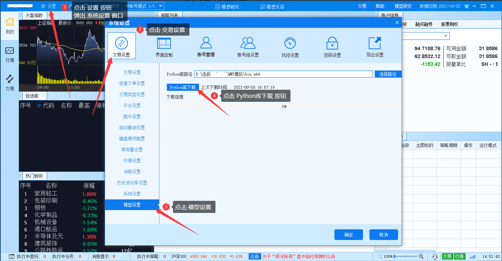
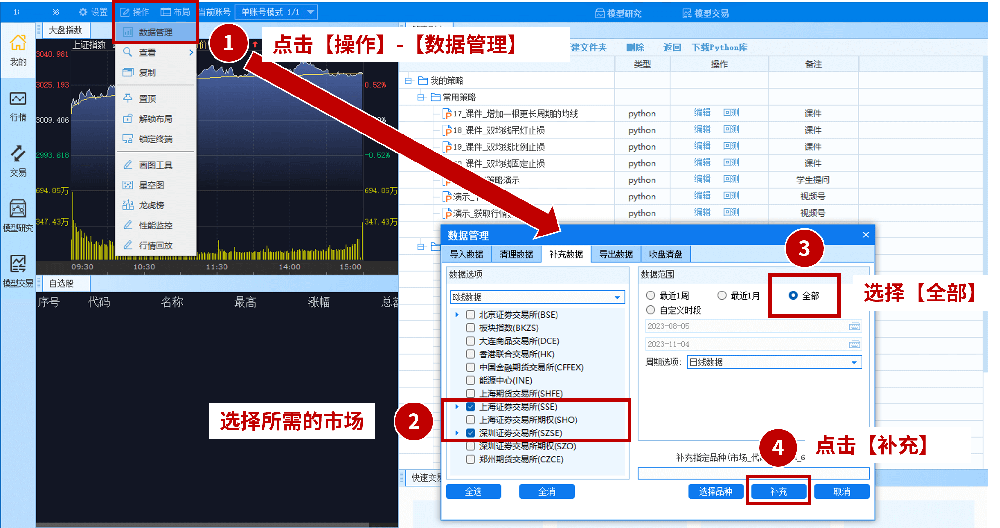
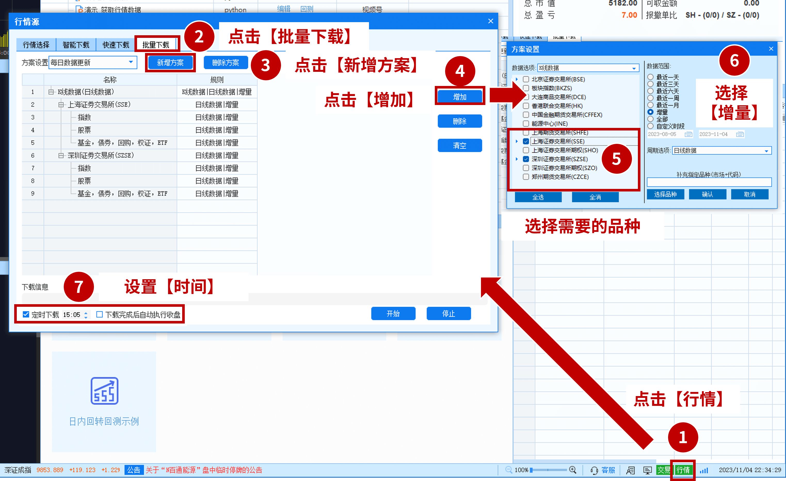
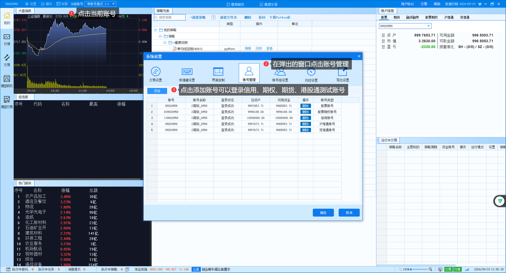
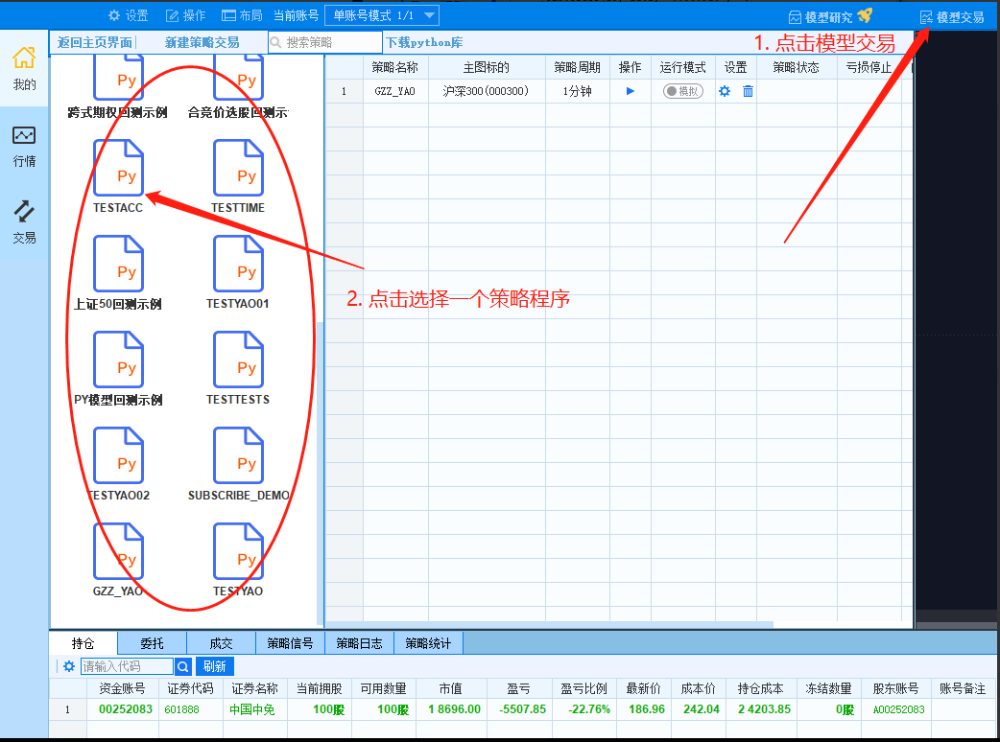

# QMT量化交易平台安装配置指南

## 概述

QMT（Quantitative Model Trading）是一个专业的量化交易开发平台，为投资者提供了完整的策略开发、回测和实盘交易环境。本章将详细介绍QMT平台的安装配置流程，帮助您快速搭建量化交易开发环境。

---

## 1. Python开发环境配置

### 1.1 内置Python库安装

QMT平台集成了专业的Python开发环境，包含量化交易所需的核心库文件。首次使用需要完成Python库的下载安装。

**安装步骤：**

1. 启动QMT客户端，点击界面顶部的"设置"按钮
2. 在弹出的系统设置窗口中，选择"交易设置"
3. 找到"模型设置"选项，点击"Python库下载"
4. 等待下载完成（请保持网络连接稳定）
5. 下载完成后重启客户端使配置生效



> **重要提示：** 建议在网络状况良好时进行下载，如遇下载缓慢可联系技术支持获取离线安装包。

### 1.2 内置Python库详解

QMT平台预装了以下专业量化分析库：

| 库名称 | 版本 | 功能描述 |
|--------|------|----------|
| **NumPy** | 1.19.1 | 高性能数值计算库，提供多维数组对象和数学函数，是科学计算的基础 |
| **Pandas** | 0.22.0 | 数据分析处理库，提供DataFrame等数据结构，支持时间序列分析 |
| **SciPy** | 1.5.2 | 科学计算库，包含统计、优化、信号处理等高级数学算法 |
| **TA-Lib** | 0.4.17 | 技术分析指标库，内置150+种技术指标和K线形态识别功能 |
| **Statsmodels** | 0.12.0 | 统计建模库，提供回归分析、时间序列分析等统计工具 |
| **Patsy** | 0.5.0 | 统计模型公式解析库，简化线性模型的构建过程 |

> **技术说明：** QMT使用Python 3.6版本，所有库均经过兼容性测试，无需额外安装Python环境。

### 1.3 环境验证测试

为确保Python环境配置正确，可通过以下代码进行验证：

**操作步骤：**

1. 点击主界面"新建策略"按钮，选择"Python策略"
2. 在代码编辑器中输入以下验证代码：

```python
# coding:gbk
import sys, numpy, pandas, patsy, scipy, statsmodels, talib

def init(ContextInfo):
    """环境信息检测函数"""
    print("=" * 50)
    print("QMT Python环境配置信息")
    print("=" * 50)
    print(f"Python版本: {sys.version}")
    print(f"NumPy版本: {numpy.__version__}")
    print(f"Pandas版本: {pandas.__version__}")
    print(f"SciPy版本: {scipy.__version__}")
    print(f"TA-Lib版本: {talib.__version__}")
    print(f"Statsmodels版本: {statsmodels.__version__}")
    print(f"Patsy版本: {patsy.__version__}")
    print("=" * 50)
    print("环境配置检测完成！")
```

3. 点击"编译"按钮进行语法检查
4. 点击"运行"按钮执行代码
5. 在日志窗口查看输出结果

**预期输出结果：**
```
==================================================
QMT Python环境配置信息
==================================================
Python版本: 3.6.8 (default, Dec 19 2022, 22:05:09) [MSC v.1900 64 bit (AMD64)]
NumPy版本: 1.19.1
Pandas版本: 0.22.0
SciPy版本: 1.5.2
TA-Lib版本: 0.4.17
Statsmodels版本: 0.12.0
Patsy版本: 0.5.0
==================================================
环境配置检测完成！
```

---

## 2. 历史数据配置

### 2.1 基础行情数据下载

量化策略开发需要充足的历史数据支持。QMT提供了便捷的数据下载功能：

**下载步骤：**

1. 点击界面左上角"操作"菜单
2. 选择"数据管理"选项
3. 配置下载参数：
   - **数据类型**：选择所需周期（日线、分钟线等）
   - **市场范围**：选择"沪深A股板块"
   - **时间范围**：建议选择"全部"获取完整历史数据
4. 点击"开始下载"等待完成



### 2.2 自动更新配置

为保持数据的时效性，建议配置每日自动更新：

**配置步骤：**

1. 点击客户端右下角"行情"按钮
2. 进入"批量下载"界面
3. 选择需要更新的数据类型
4. 勾选"定时下载"选项
5. 设置合适的更新时间（建议选择收盘后时段）



> **最佳实践：** 
> - 建议在休盘时间进行数据下载，网络速度更快
> - 优先下载1分钟K线数据，可用于多周期分析
> - 定期检查数据完整性，确保策略回测准确性

---

## 3. 交易账户配置

### 3.1 模拟账户绑定

QMT支持模拟交易功能，为策略测试提供安全环境：

**绑定步骤：**

1. 点击界面顶部"当前账号"按钮
2. 在系统设置窗口中选择"账号管理"
3. 输入获取的模拟账号信息
4. 完成登录验证



**支持的账户类型：**
- 股票交易账户（基础）
- 信用交易账户（融资融券）
- 期权交易账户
- 期货交易账户
- 港股通账户

> **注意事项：** 不同账户类型需要相应的交易权限，如需开通请联系客服支持。

### 3.2 交易功能测试

账户绑定完成后，需要验证交易功能是否正常：

**测试代码示例：**

```python
# coding:gbk
import time

def init(ContextInfo):
    """策略初始化函数"""
    # 设置交易账户（请替换为您的实际账号）
    ContextInfo.set_account('模拟账户号')
    
    # 设置监控股票列表
    stock_list = ['000001.SZ']  # 平安银行
    
    # 设置定时执行函数（每30秒执行一次）
    ContextInfo.run_time("trading_test", "30nSecond", "1970-01-01 00:00:00", "SH")

def trading_test(ContextInfo):
    """交易功能测试函数"""
    print("=" * 40)
    print("执行交易功能测试...")
    
    # 获取账户信息
    account_info = ContextInfo.get_account_info()
    print(f"账户资金: {account_info.get('total_asset', 0):.2f}")
    
    # 模拟下单测试（小额测试单）
    test_symbol = '000001.SZ'
    test_quantity = 100
    
    try:
        # 执行测试买单（市价单）
        order_result = passorder(
            23,           # 买入操作
            1101,         # 股票交易
            ContextInfo.accID,  # 账户ID
            test_symbol,  # 股票代码
            5,            # 市价单
            0,            # 价格（市价单时为0）
            test_quantity, # 数量
            "1",          # 策略名称
            1,            # 下单方式
            "1",          # 备注
            ContextInfo
        )
        
        if order_result:
            print(f"测试订单提交成功: {test_symbol}")
        else:
            print("测试订单提交失败，请检查账户权限")
            
    except Exception as e:
        print(f"交易测试异常: {str(e)}")
    
    print("=" * 40)
```

**测试流程：**

1. 将代码保存为策略文件（如"AccountTest"）
2. 点击"编译"检查语法
3. 点击"运行"执行测试
4. 观察日志输出，确认功能正常

### 3.3 实盘交易配置

测试通过后，可切换到实盘交易模式：

**切换步骤：**

1. 进入"模型交易"界面
2. 选择已创建的策略
3. 点击"新建策略交易"
4. 配置交易参数：
   - **账户类型**：选择对应的交易账户
   - **资金账号**：输入实际账号
   - **主图代码**：设置监控股票
   - **运行周期**：选择策略执行频率
5. 点击"运行模式"切换到"实盘"
6. 确认风险提示后开始运行



> **风险提示：** 实盘交易涉及真实资金，请在充分测试后谨慎操作。

---

## 4. 系统优化建议

### 4.1 性能优化配置

为提升QMT运行效率，建议进行以下优化：

**硬件要求：**
- CPU：Intel i5或同等性能以上
- 内存：8GB以上（推荐16GB）
- 硬盘：SSD固态硬盘（提升数据读取速度）
- 网络：稳定的宽带连接

**软件配置：**
- 关闭不必要的后台程序
- 设置QMT为高优先级进程
- 定期清理日志文件和临时数据
- 保持系统和软件版本更新

### 4.2 数据管理优化

**存储策略：**
- 按需下载数据，避免占用过多磁盘空间
- 定期备份重要策略代码和配置
- 使用数据压缩减少存储占用
- 建立数据版本管理机制

**访问优化：**
- 使用本地数据缓存提升访问速度
- 合理设置数据更新频率
- 避免重复下载相同数据
- 监控数据质量，及时处理异常

### 4.3 安全配置建议

**账户安全：**
- 定期更换账户密码
- 启用双因子认证（如支持）
- 限制登录IP地址范围
- 监控异常交易行为

**代码安全：**
- 对重要策略代码进行加密保护
- 建立代码版本控制系统
- 定期备份策略文件
- 避免在代码中硬编码敏感信息

---

## 5. 常见问题解决

### 5.1 安装问题

**Q: Python库下载失败怎么办？**

A: 解决方案：
1. 检查网络连接是否稳定
2. 尝试更换下载时间（避开网络高峰期）
3. 联系技术支持获取离线安装包
4. 检查防火墙设置是否阻止下载

**Q: 客户端启动异常？**

A: 排查步骤：
1. 检查系统兼容性（推荐Windows 10及以上）
2. 以管理员权限运行程序
3. 关闭杀毒软件的实时保护
4. 重新安装客户端程序

### 5.2 数据问题

**Q: 历史数据不完整？**

A: 处理方法：
1. 重新下载对应时间段的数据
2. 检查数据源设置是否正确
3. 验证网络连接稳定性
4. 联系技术支持确认数据源状态

**Q: 实时数据延迟？**

A: 优化建议：
1. 检查网络带宽是否充足
2. 关闭不必要的数据订阅
3. 优化策略代码减少计算量
4. 考虑升级硬件配置

### 5.3 交易问题

**Q: 下单失败？**

A: 检查项目：
1. 账户权限是否开通
2. 资金是否充足
3. 股票是否停牌或涨跌停
4. 交易时间是否正确
5. 订单参数是否合规

**Q: 策略运行异常？**

A: 调试方法：
1. 检查代码语法错误
2. 验证数据完整性
3. 增加异常处理机制
4. 使用日志记录调试信息

---

## 6. 总结

通过本章的学习，您已经掌握了QMT量化交易平台的完整安装配置流程：

1. ✅ **Python环境配置** - 完成开发环境搭建
2. ✅ **历史数据准备** - 建立数据基础
3. ✅ **账户绑定测试** - 验证交易功能
4. ✅ **系统优化配置** - 提升运行效率

接下来您可以：
- 学习QMT的核心API函数
- 开发自己的量化策略
- 进行策略回测和优化
- 部署实盘交易系统

> **下一步建议：** 建议继续学习第2章"重要方法和对象"，深入了解QMT的编程接口。

---

*最后更新时间: 2024年8月16日*