# QMT量化交易回测教程

## 文档说明

本文档主要描述 量化程序交易 回测的功能。因此 迅投QMT 的基本操作教程，并未涉及。如果对 QMT 基础操作还不熟悉的朋友，建议先熟悉一下界面风格、基本操作，可联系我获取单均线回测示例以用来快速上手。

## 2.1 策略列表


成功登录 迅投QMT之后，在主页界面中间部分即可看到 “策略列表”，其中应该包含的是 “我的策略”。如果点击 “返回”按钮，可以看到全部的（更多的）策略列表，如下图所示：

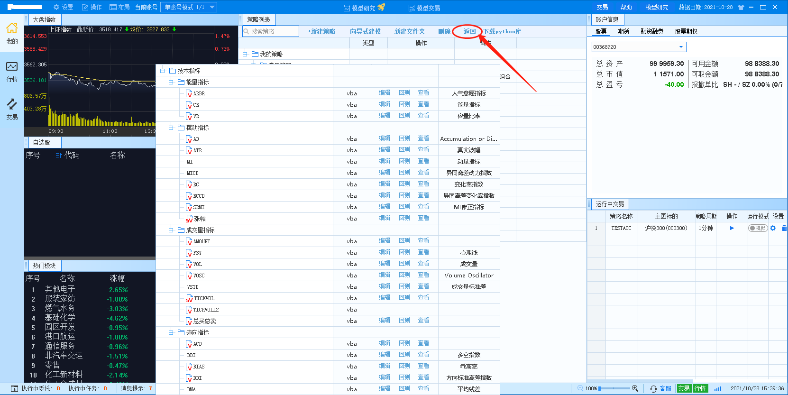


#### 2.1.1 导入导出策略

QMT系统支持将策略以**加密**的模式进行导出或导入，用户可以便捷的迁移系统本地策略，可以通过点击`导入策略`将单均线回测示例导入到qmt里面，如下图所示：


#### 2.1.2 新建策略

也可以在【模型研究】界面，点击`新建模型`，选择 Python 模型，在弹出的【策略编辑器】中从头到尾编写一个用户自己的量化模型。

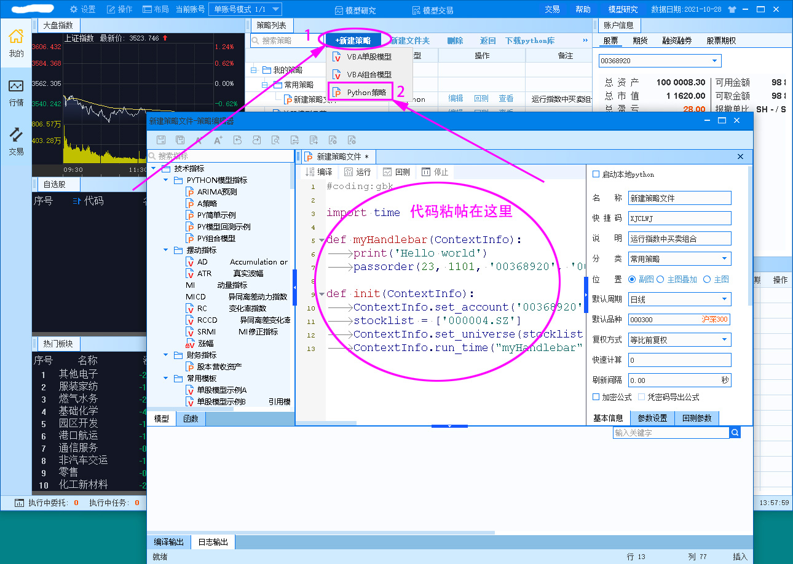


现在我们来创建第一个策略程序吧。如之前在安装步骤中的操作，请点击中间上侧的 “新建策略”按钮，然后选择 “Python” 策略，然后把下列代码复制到窗口中。

```python
#---------------------------------------------------
#coding:gbk
import pandas as pd
import numpy as np
import talib
import time
#---------------------------------------------------


#---------------------------------------------------
def init(C):
	C.accid ='55002616'#设定资金账户账户
	C.stock=['000568.SZ']#SH,SZ必须大写
	down_history_data("000568.SZ","1d","","")
	C.cycle=60#均线周期
	print('')
	print('---------------------------------------------------')
	print('股票池:',C.stock)
	print('---------------------------------------------------')
#---------------------------------------------------


#---------------------------------------------------
def handlebar(C):
#---------------------------------------------------
#获得系统时间，回测bar-1
	bar_date=timetag_to_datetime(C.get_bar_timetag(C.barpos-1),'%Y%m%d%H%M%S')#专门获取历史数据的
	index =C.barpos
	realtimetag=C.get_bar_timetag(index-1)
	shi_jian=timetag_to_datetime(realtimetag, '%Y-%m-%d %H:%M:%S')
	shi_jian_shi=int(timetag_to_datetime(realtimetag,'%H'))
	shi_jian_fen=int(timetag_to_datetime(realtimetag,'%M'))
	shi_jian_miao=int(timetag_to_datetime(realtimetag,'%S'))
	shi_jian_zong=shi_jian_shi*60+shi_jian_fen
	print('K线时间',shi_jian)
#---------------------------------------------------


#---------------------------------------------------
#显示仓位曲线
	x1=get_zong_zichan(C.accid)-get_avaliable(C.accid)
	y1=get_zong_zichan(C.accid)
	value=x1/y1
	C.paint('持仓比例',value,-1,2,'red','noaxis')
#---------------------------------------------------


#---------------------------------------------------
#测试窗口
	xianshi_zhanghu(C.accid)#显示资金账户的信息
#	xianshi_chichang(C.accid)#显示持仓的信息	
#---------------------------------------------------


#---------------------------------------------------
	holdings=get_holdings(C.accid)#获取持仓数据，数据类型是dict
#---------------------------------------------------
	for  stock  in  C.stock:#循环提前股票池中的股票
		local_data=C.get_market_data_ex(['close'],stock_code=[stock],end_time = bar_date,
		period='1d',count=60,dividend_type='front',fill_data=True,subscribe=True)
		close_list=list(local_data[stock].iloc[:, 0])
#---------------------------------
		stock_price=close_list[-1]
		name=C.get_stock_name(stock)
		print(shi_jian,'名称:',name,'当前价格',stock_price)
		stock_junjia=round(np.sum(close_list)/C.cycle,2)
		print(shi_jian,'名称:',name,';',C.cycle,'日均线是:',stock_junjia)
#--------------------------

#--------------------------
		if stock_junjia<stock_price and stock  not  in  list(holdings):#站上均线，买进
			buytarget_num=int(get_zong_zichan(C.accid)*(1.0)/stock_price/100)#买入单位是手，没有小数
			buy_num=buytarget_num*100#手转换成股
			if buy_num>0:#单位是股
				passorder(23,1101,C.accid,stock,11,stock_price*1.0,buy_num,'名称',1,'委托号',C)#买入
				print('买入', '名称:',name,stock,'股数',buy_num,'价格:',stock_price,'市值',round(buy_num*stock_price,2))
#--------------------------

#--------------------------
		elif stock_junjia>stock_price  and  stock  in  list(holdings):#均线压着股价，卖出
			sell_num=holdings[stock]
			if sell_num>0:#单位是股
				passorder(24,1101,C.accid,stock,11,stock_price*1.0,sell_num,'名称',1,'委托号',C)#卖出
				print('卖出', '名称:',name,stock,'股数',sell_num,'价格:',stock_price,'市值',round(sell_num*stock_price,2))
#---------------------------------------------------


#---------------------------------------------------分函数
#---------------------------------------------------
def bardate_translations(X,Y):
	Z=X*60+Y
	return Z
#---------------------------------------------------


#---------------------------------------------------
def get_holdings2(accid,stock):
#查询股票当前持仓，如果没有持仓，则返回0，这是一个小优化
	holdinglist={}
	resultlist=get_trade_detail_data(accid,'STOCK',"POSITION")
	for obj in resultlist:
		holdinglist[obj.m_strInstrumentID+"."+obj.m_strExchangeID]=obj.m_nVolume
#---------------------------------------------------
	if  stock in list(holdinglist):
		return holdinglist[stock]
	else:
		return 0
#---------------------------------------------------


#---------------------------------------------------
#获取持仓，返回dict，如果查询未持有的持仓，会报错
def get_holdings(accid):
	holdinglist={}
	resultlist=get_trade_detail_data(accid,'STOCK',"POSITION")
	for obj in resultlist:
		holdinglist[obj.m_strInstrumentID+"."+obj.m_strExchangeID]=obj.m_nVolume
	return holdinglist
#---------------------------------------------------


#---------------------------------------------------
#获取总资产
def get_zong_zichan(accid):
	zichan=0
	account= get_trade_detail_data(accid,'stock', "ACCOUNT")
	for  i in account:
		zichan=i.m_dBalance
	return zichan
#---------------------------------------------------


#---------------------------------------------------
#显示持仓
def xianshi_chichang(accid,time):
	position_info= get_trade_detail_data(accid,'stock','position')
	for i in position_info:
		print(
		time,
		'名称',i.m_strInstrumentID+"."+i.m_strExchangeID,
		'数量',i.m_nVolume,
		'盈亏比例',round(i.m_dProfitRate,2),
		'持有市值',i.m_dMarketValue,
		'持仓成本',i.m_dOpenPrice,
		'建仓日期',i.m_strOpenDate
		)
#---------------------------------------------------


#---------------------------------------------------
#显示账户信息
def xianshi_zhanghu(accid):
	account= get_trade_detail_data(accid,'stock', "ACCOUNT")
	for  i in account:
		print(
		'总资产',i.m_dBalance,
		'可用金额',i.m_dAvailable,
		'持仓盈亏',i.m_dPositionProfit
		)
#---------------------------------------------------


#---------------------------------------------------
#获取可用资产
def get_avaliable(accid):
	result=0
	account= get_trade_detail_data(accid,'stock', "ACCOUNT")
	for  i in account:
		result=i.m_dAvailable
	return result
#---------------------------------------------------

```


#### 2.1.3 策略编写

【策略编辑器】是迅投专门为模型开发者设计的，集成了模型列表、函数列表、函数帮助、模型基本信息、参数设置、回测参数等多个部分，拥有代码高亮、自动补全等便捷功能于一体的便捷的模型编辑、开发环境。

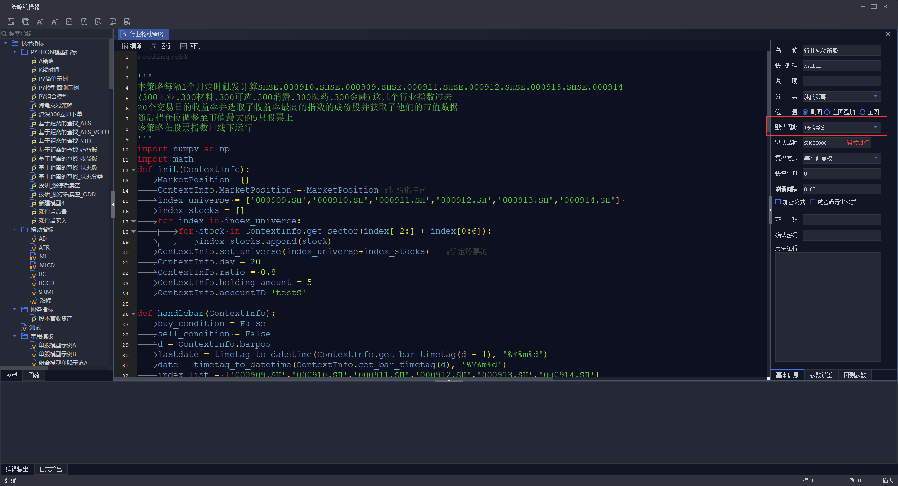


**模型编辑页面 右侧可选择策略默认的周期、品种**

编写 Python 策略需在开始时定义编码格式，如 `gbk`。

之后可选择导入第三方库，所选第三方库要在券商管理端白名单内才可运行。

Init 方法和 handlebar 方法的定义是必须的。Init 方法会在策略运行开始时调用一次，用以初始化所需对象（包裹在 ContextInfo 对象中传递），设定股票池等。

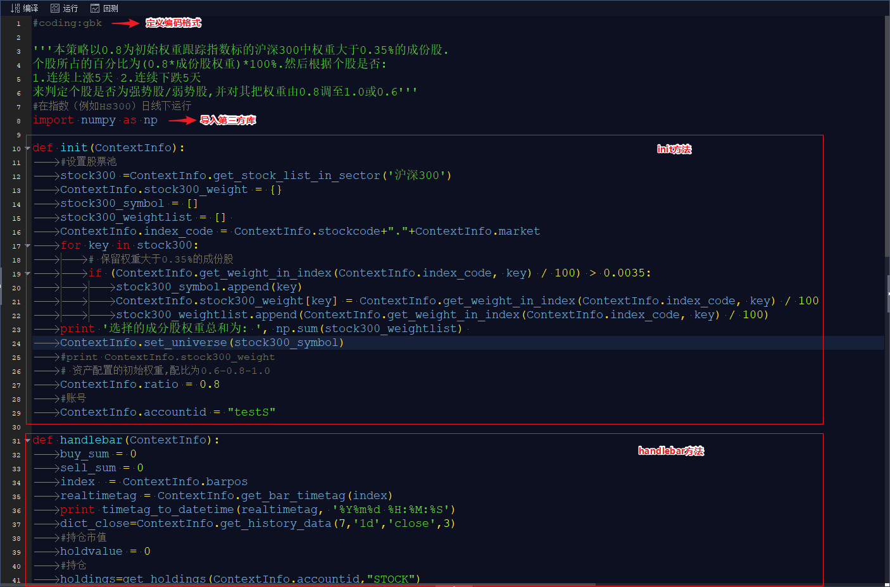

**Handlebar 方法会在历史 K 线上逐 K 线调用，系统会保存函数所做更改。**

在盘中交易时间，handlebar 函数会随行情推送（tick 数据）被调用，当一个 tick 数据为所在 K 线最后一个 tick 时，此 tick 调用的 handlebar 所做的更改会被系统保存，如有交易指令，会在下一根K 线的第一个 tick 到来时发送；其他 tick 可以打印运行结果，但 handlebar 所做更改不会被保存，也不会发送交易信号。

编写创建完模型后，对应模型的基本信息和回测参数进行设置。

**基本信息-字段描述**

| 字段               | 描述                                                         |
| ------------------ | ------------------------------------------------------------ |
| **名称**           | 填写模型名称                                                 |
| **快捷码**         | 默认根据模型名称自动生成拼音首字母拼写，如需自定义可以手动进行更改，用于键盘精灵快速引用模型 |
| **说明**           | 简单的说明模型功能                                           |
| **分类**           | 保存当前模型到某个分类下面                                   |
| **位置**           | 模型回测或运行时的位置，有副图、主图叠加、主图三种显示位置   |
| **默认周期**       | 点击模型回测或运行时的默认主图周期，可手动切换               |
| **默认品种**       | 点击模型回测或运行时的默认主图品种，可手动切换               |
| **复权方式**       | 提供不复权、前复权、后复权、等比前复权、等比后复权 5 种复权方式 |
| **快速计算**       | 限制计算范围，默认为 0 时模型运行会从模型设置的默认品种（主图）的第一根 K 线开始计算，设置为 n 则从当前 K 线再往前 n 个 K 线开始计算 |
| **刷新间隔**       | 用来设置策略运行的时间间隔。设置了刷新间隔，即每隔一段时间策略按照当前行情运行一次 |
| **加密公式**       | 加密后的公式只有输入密码才可以查看源代码                     |
| **凭密码导出公式** | 此项只有在开启 “加密公式” 后才能生效，生效后只能使用密码导出到本地 |
| **用法注释**       | 简短的说明模型使用的一些注意项，可不填                       |

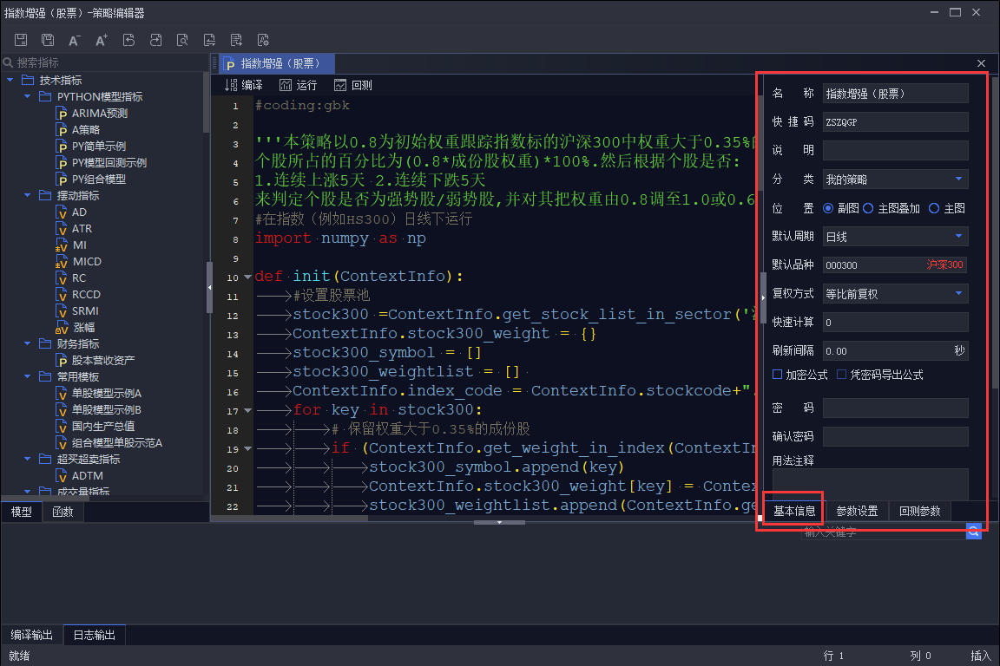

**策略编辑器-基本信息**

回测模式指策略以历史行情为依据进行运算，投资者可观察该策略在历史行情所获得的年化收益率、夏普比率、最大回撤、信息比率等指标表现。

**回测参数-字段描述**

| 字段                  | 描述                                                         |
| --------------------- | ------------------------------------------------------------ |
| **开始时间 结束时间** | 设置模型回测时间区间                                         |
| **基准**              | 设置模型收益的参考基准                                       |
| **初始资金**          | 设置模型回测的初始资金                                       |
| **保证金比例**        | 设置期货的保证金比例                                         |
| **滑点**              | 设置回测撮合时的滑点，模拟真实交易的冲击成本                 |
| **手续费类型**        | 支持按成交额比例或者固定值计算手续费                         |
| **买入印花税**        | 设置买入印花税比例                                           |
| **卖出印花税**        | 设置卖出印花税比例                                           |
| **最低佣金**          | 设置单笔交易的最低佣金数额                                   |
| **买入佣金**          | 设置买入标的时的佣金比例                                     |
| **平昨佣金**          | 设置股票、期货平昨佣金比例                                   |
| **平今佣金**          | 设置期货平今佣金比例                                         |
| **最大成交比例**      | 控制回测中最大成交量不超过同期成交量*最大成交比例。可以点击此参数旁边的'？'按钮了解详情 |

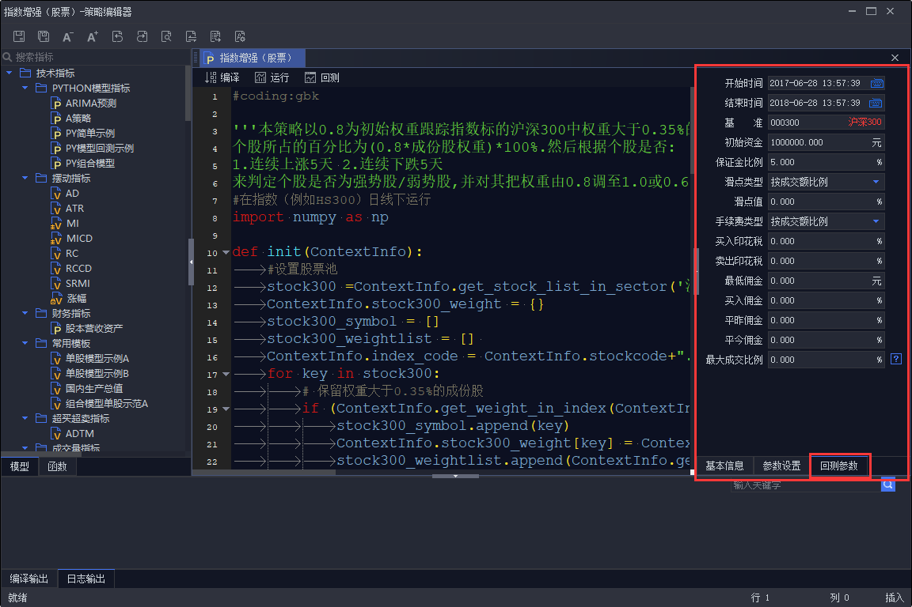

在这个简单示例中，可以看到。在 迅投QMT中，编写 Python 程序，第一行声明了字符集是 `#coding:gbk` 。其中最重要的两个自定义函数就是 **init()** 和 **handlebar()**

init() —— 是初始化函数，即策略程序一启动，首先执行此函数。通常在这个函数中，书写获取股票池、验证帐号、声明全局变量等语句；

handlebar() —— 表示每一根 K 线收盘后，即执行一次此函数。策略的核心逻辑都是写在该函数中的，比如，需要获取什么数据，获取后如何计算，得出结果后是否下单交易等等。通常用户还可以通过 paint() 方法将需要绘图输出的结果展示出来。

其中 **ContextInfo** 是整个 Python 框架中的核心对象。它包含了各种与 Python 底层框架交互的 API 方法，也是一个全局的关联上下文的对象（object），可以在 init 以及 handlebar 这两个函数中自由地传递用户创建的各种自定义数据。


### 2.2 参数设置

在“策略编辑器”的右侧，基本信息面板的底部，中间的标签是“参数设置”，用鼠标点击一下该标签，即可在这里可以设置策略程序中的外部参数。通常用于策略程序源码必须加密，但同时又要允许用户可以自己修改参数的需求；或者用历史数据回测时，优化参数时使用。最多允许设置20个外部参数。在对应的栏位中填上“参数名”、“最新（值）”、“最小（值）”、“最大（值）”、“步长”、“初始（值）”，填完之后回车即可。

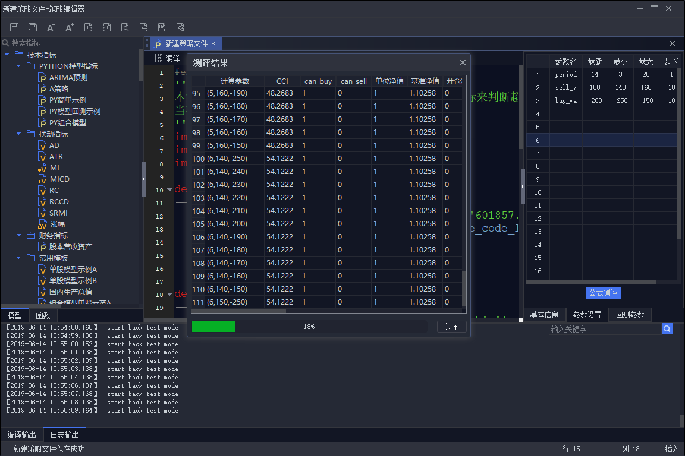


在“参数设置”面板中填写的参数，可以理解为就是在策略程序中声明的全局变量，在策略中的各个方法（函数）中都是可见的，包括用户自定义的函数中，也是可见的。因此在程序中可以直接使用，赋值、参与运算都可以。如上图中的示例，在参数设置中，填写了3个变量，`period,sell_v,buy_va`，并且填写了各自的值。回车之后，在策略程序中，就可以直接打印出这些变量的值。并不需要提前声明或赋值操作。


## 2.3 策略运行

策略编写完毕后，点击编译，可保存策略。编译按钮在 Python 策略中只起保存功能，不会检查语法与引用的正误。之后点击运行可以看到策略运行效果（如有错误，会在日志输出的位置报错）。

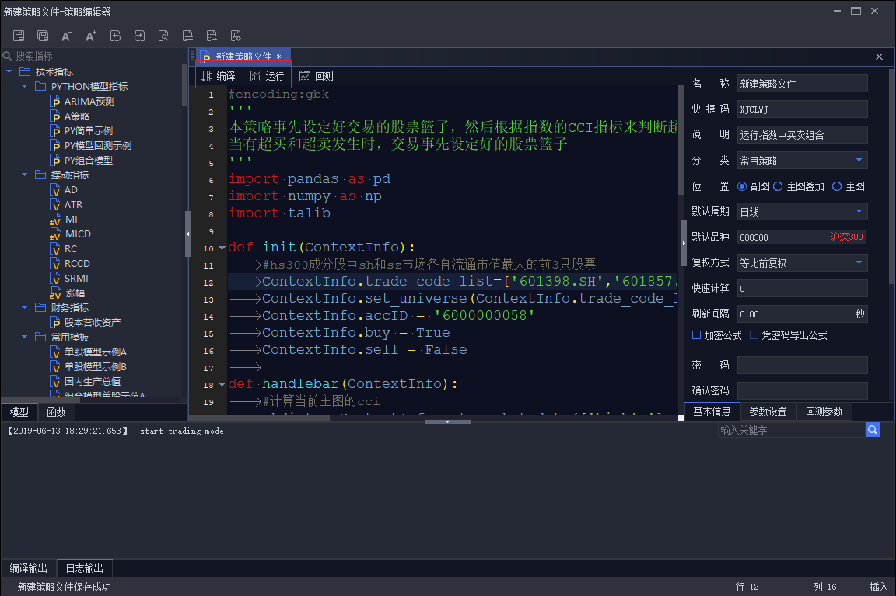

*策略编辑器-运行*

如当前系统所处界面为“行情”界面或“交易”界面，点击运行之前，需在行情中手动设置好 K 线品种和周期，点击运行后，策略即可在当前主图下运行，如下图所示。

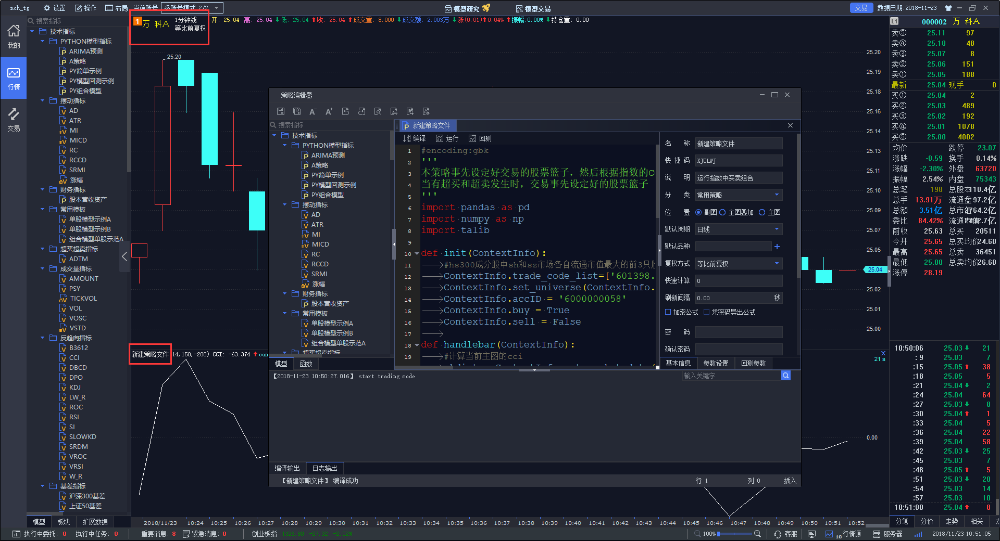

*策略运行状态之一*

如系统当前界面处于“我的主页”界面或“模型研究”和“模型交易”等非行情界面，点击运行时，会基于策略编辑器 - 基本信息中所设置的默认周期和默认品种运行。

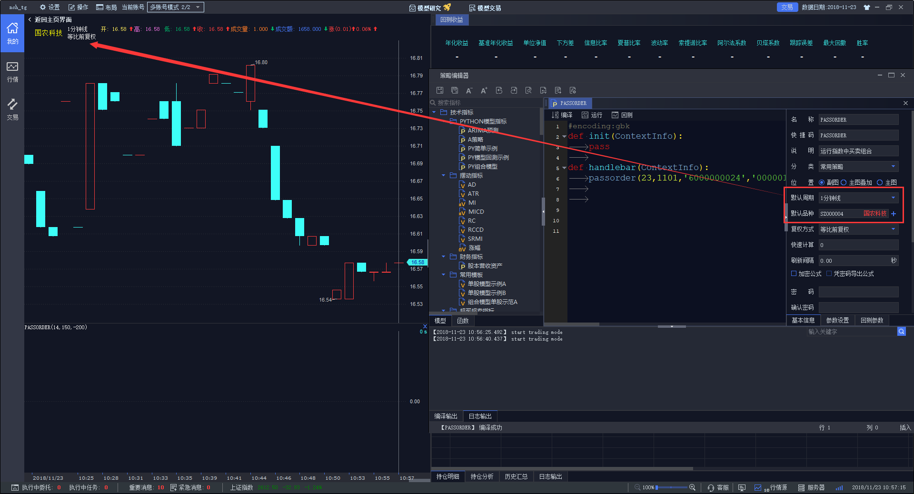

*策略运行状态之二*

当选择的运行位置为副图时，

如想关闭策略，将主图下方策略运行的附图关闭即可。


*关闭运行中的策略之一*

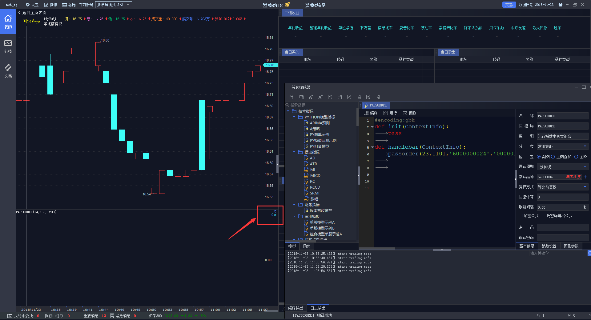

*关闭运行中的策略之二*

当选择的运行位置为主图叠加时，如想关闭策略，在主图上右键单击取消叠加指标即可。

当选择的运行位置为主图时，键盘精灵输入KLINE即可结束模型运行。

*关闭运行中的策略之三*

点击策略编辑器上放的停止按钮

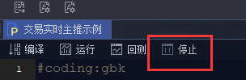

## 2.4 策略调试

如果策略运行不成功，需要进行策略调试这一步。当运行出错时，报错信息会显示在日志输出面板，以供修改调试之用。

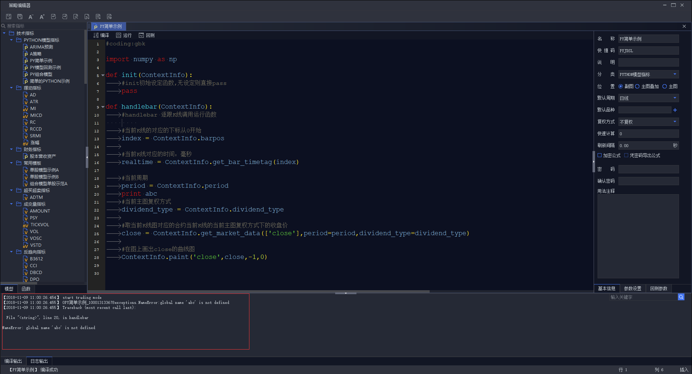

*策略调试-输出日志*

## 3 历史数据回测

在 迅投 的主界面中，“我的” --> “模型研究” 中，有一个 “PY模型回测示例” ，如下图所示：

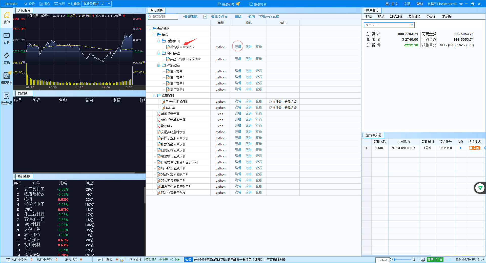

点击其后的编辑按钮，即可看到源代码。策略说明描述大致如下：
设定股票池为`000568.SZ`，关注 60日均线。
如果当前价格高于60日均线，并且该股票不在持仓中，则执行买入操作。
果当前价格低于60日均线，并且该股票在持仓中，则执行卖出操作。

该示例中，导入了 time, talib 和 numpy 模块，分别用来计算日期时间和平均值（均线）。同时还用到自定义函数来获取持仓股票列表。调取历史数据（如果之前没有补齐历史数据，会导致失败和错误）等功能，具体代码的解析，在阅读理解了 api 手册之后会有更详细的讨论。

第一步，点击右侧面板底部的“回测参数”按钮，以切换到 回测参数 面板。在此处可以选择回测的时间段，前提条件是下载过历史数据。其它参数可按需填写，如：初始资金、保证金比例、印花税等......

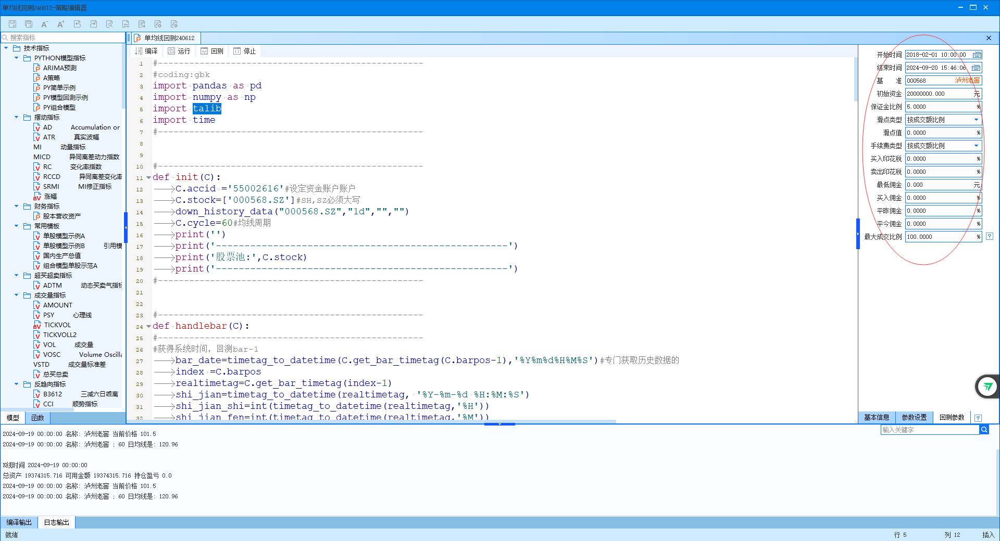

第二步，点击“策略编辑器”顶部的 “回测”按钮，即可开始历史数据回测。如果有历史数据，回测过程会顺利进行。在“模型研究”窗口，可以看到数据变化。

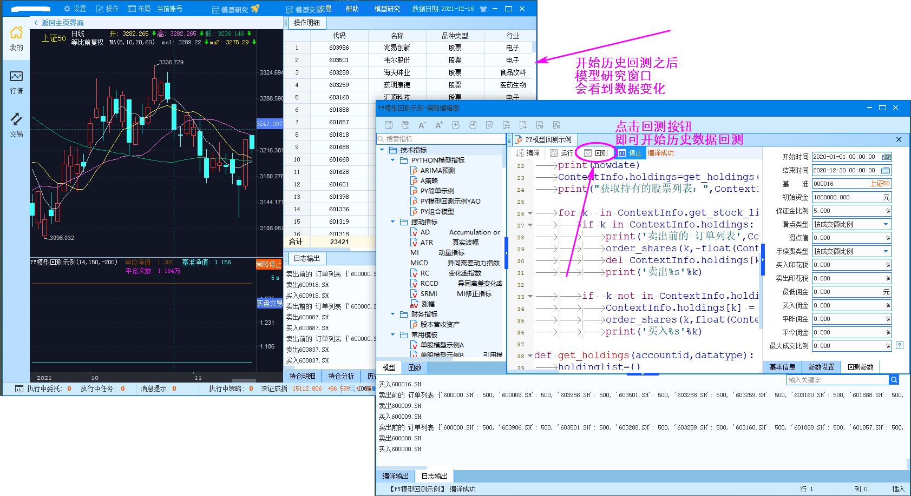

*操作-数据管理*

如果回测正常的话，主界面会跳转到模型设置的默认标的和默认周期界面，并输出模型绩效分析结果。

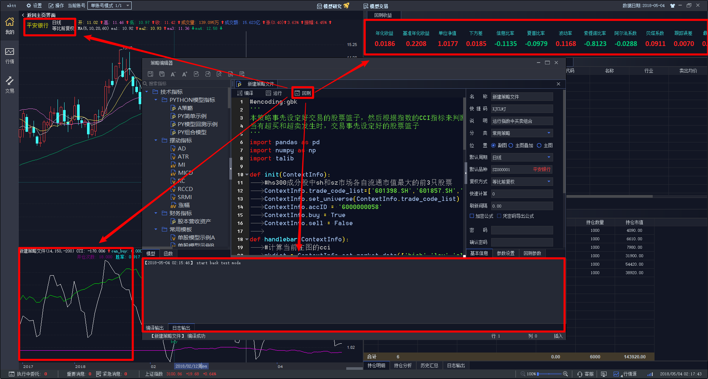

*策略编辑器-模型回测*

此时，可最小化或者关闭【策略编辑器】，并对回测结果进行分析，随着光标在 K 线主图上的移动，右边回测结果展示窗口会动态显示截止光标所在当日的绩效分析结果（包括年化收益，基准年化收益，单位净值，下方差，信息比率，夏普比率，波动率，索提诺比率，阿尔法系数，贝塔系数，跟踪误差，最大回撤，胜率等）、当日买入、当日卖出、持仓列表。

以上列表均可鼠标右键复制和导出数据。

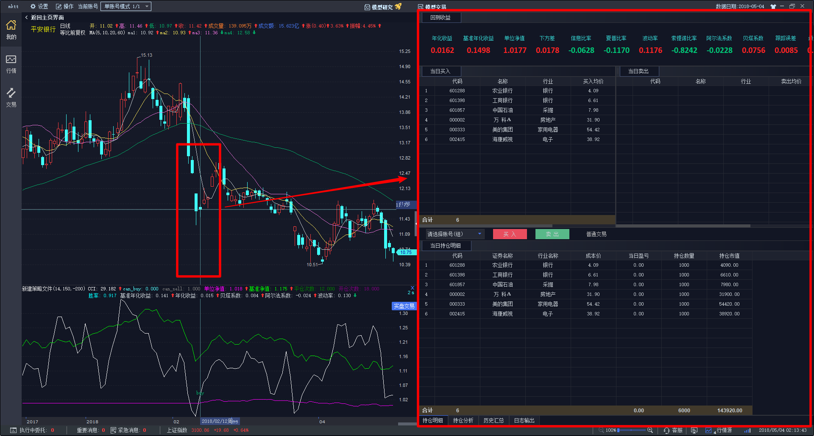

*回测结果分析-回测结果随十字光标移动动态展示*

如需根据模型生成的买入、卖出列表进行手工交易，则可直接点击“买入'或“卖出'按钮，系统会弹出下单界面由用户进行确认后进行普通交易下单或算法交易下单。交易方式可点击卖出按钮右侧的普通交易进行切换设置。

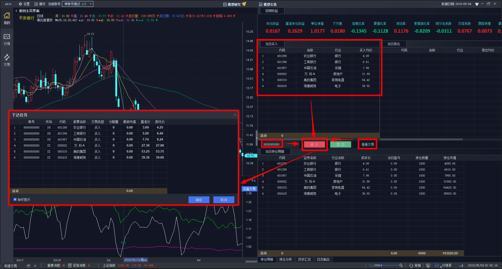

*回测结果买入*

副图回测指标：提供图形化的展示，除去绩效分析的相关指标外，用户可以通过编辑模型代码自定义输出一些特色指标，鼠标右键可以选择复制模型运行结果（每一天的数据）。

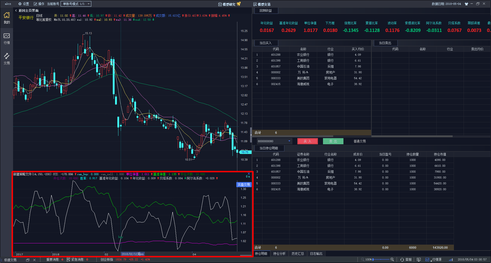

*回测结果分析-附图指标输出*

另外，回测结果还提供了持仓分析、历史板块汇总、操作明细、日志输出等信息，方便用户进行深入分析。

<div style="border-left: 5px solid #008000; padding-left: 10px; margin: 10px 0;">
    <p>说明</p>
    <p>持仓分析： 可查看光标所在当天持仓的行业分布，展示在相关行业的市值情况、盈利情况、权重以及股票数量情况，右键可以复制和导出数据；可切换对比基准，和模型持仓进行对比。</p
     p>历史板块汇总： 可查看模型自回测日期以来到光标所在日期该模型交易标的的汇总信息，包括累计盈亏、累计交易量、累计交易额、持仓天数等；点击选择板块，可以自行选择其常用板块进行板块的各项数据累计汇总；汇总数据均可以进行排序，鼠标右键可以复制和导出数据。</p
     <p>操作明细：可查看模型回测的历史每一笔交易的明细。</p>
     <p>日志输出： 可用于调试输出模型回测和运行情况
         。</p>

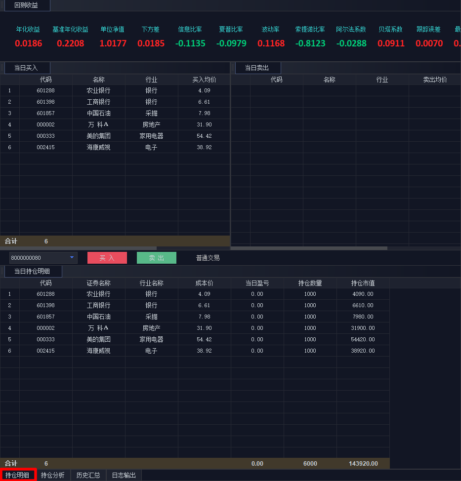

*回测结果分析-绩效分析、当日买入、当日卖出、当日持仓*

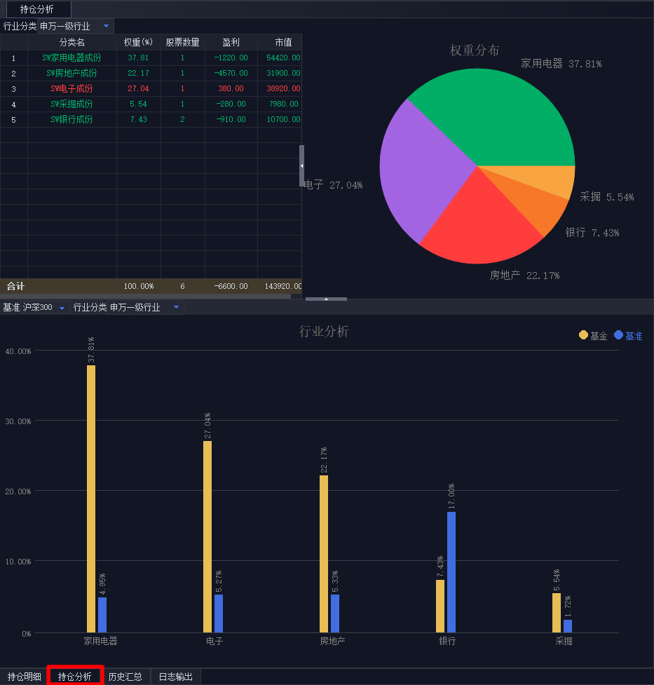

*回测结果分析-持仓分析*

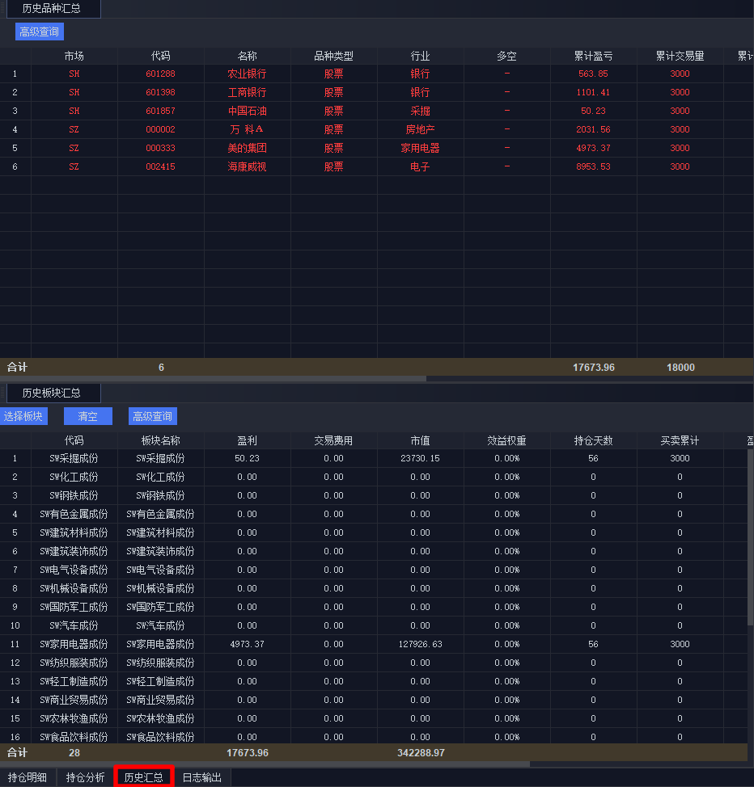

*回测结果分析-历史品种汇总、历史板块汇总*

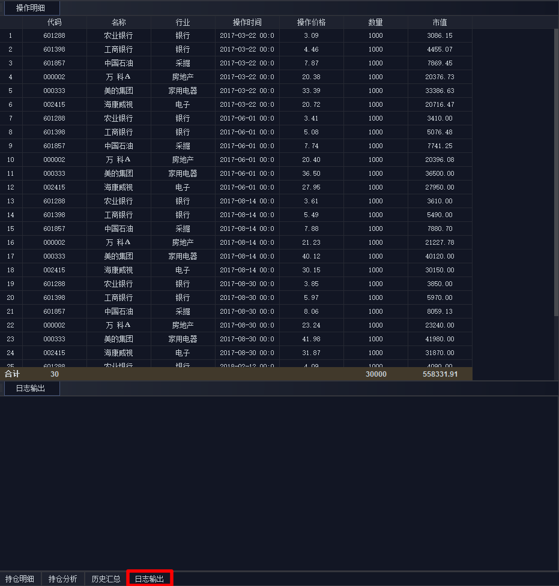

*回测结果分析-操作明细、日志输出*

<div style="border-left: 5px solid #008000; padding-left: 10px; margin: 10px 0;">
    <p>提示</p>
    <p>一般约定 在 迅投 中编写一个 Python 策略时，第一行我们写上</p
     p># coding:gbk</p
</div>

  这表示程序的编码格式统一是GBK