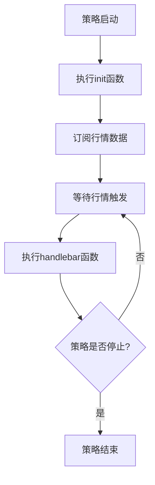

# QMT核心编程框架详解

## 概述

QMT量化交易平台采用面向对象的编程架构，为策略开发提供了标准化的编程框架。本章将深入解析QMT的核心编程组件，包括关键函数、重要对象以及它们之间的协作机制。

---

## 1. QMT编程架构基础

### 1.1 策略类继承机制

在QMT中开发Python策略时，实际上是在一个预定义的基类框架内进行编程。这个基类为策略开发提供了标准化的接口和生命周期管理。

**核心组件包括：**
- **初始化函数** `init()` - 策略启动时的配置入口
- **行情处理函数** `handlebar()` - 核心交易逻辑执行器
- **上下文对象** `ContextInfo` - 策略运行环境的数据中心

### 1.2 策略生命周期



---

## 2. 初始化函数 init()

### 2.1 函数定义与作用

`init()` 函数是策略的初始化入口，在整个策略生命周期中仅执行一次。它负责完成策略运行前的所有准备工作。

**函数签名：**
```python
def init(ContextInfo):
    """
    策略初始化函数
    
    Args:
        ContextInfo: 策略运行环境对象，用于存储全局变量和配置
    
    Returns:
        None
    """
    pass
```

**主要职责：**
1. 设置交易账户信息
2. 配置策略参数（手续费、滑点等）
3. 订阅行情数据
4. 初始化全局变量
5. 设置定时任务

### 2.2 典型初始化示例

```python
def init(ContextInfo):
    """完整的策略初始化示例"""
    
    # 1. 设置交易账户
    ContextInfo.set_account('模拟账户号')
    
    # 2. 配置回测参数
    ContextInfo.capital = 1000000  # 初始资金100万
    ContextInfo.set_commission(0.0003)  # 万三手续费
    ContextInfo.set_slippage(1, 0.01)  # 固定滑点1分钱
    
    # 3. 初始化策略变量
    ContextInfo.strategy_params = {
        'ma_short': 5,    # 短期均线周期
        'ma_long': 20,    # 长期均线周期
        'position_size': 0.1  # 单次建仓比例
    }
    
    # 4. 设置股票池
    stock_pool = ['000001.SZ', '000002.SZ', '600000.SH']
    ContextInfo.target_stocks = stock_pool
    
    # 5. 订阅行情数据
    for stock in stock_pool:
        ContextInfo.subscribe_quote(stock, period='1d')
    
    print("策略初始化完成")
```

### 2.3 行情订阅机制

在`init()`函数中可以设置自定义的行情回调函数：

```python
def init(ContextInfo):
    """行情订阅示例"""
    
    def market_data_callback(data):
        """自定义行情回调函数"""
        symbol = data.get('symbol')
        price = data.get('last_price')
        volume = data.get('volume')
        
        print(f"收到行情: {symbol} 价格:{price} 成交量:{volume}")
        
        # 在回调中可以执行交易逻辑
        # 注意：需要传入ContextInfo对象
        if price > data.get('pre_close') * 1.05:  # 涨停
            print(f"{symbol} 涨停，执行相应策略")
    
    # 订阅5分钟K线数据
    target_stock = '600000.SH'
    ContextInfo.subscribe_quote(
        target_stock, 
        period='5m', 
        callback=market_data_callback
    )
    
    print("行情订阅设置完成")
```

---

## 3. 行情处理函数 handlebar()

### 3.1 函数定义与触发机制

`handlebar()` 函数是策略的核心执行器，负责处理每次行情更新时的交易逻辑。

**函数签名：**
```python
def handlebar(ContextInfo):
    """
    行情处理函数
    
    触发条件：
    - 回测模式：每根K线触发一次
    - 实盘模式：每次tick数据到达时触发
    
    Args:
        ContextInfo: 策略运行环境对象
    
    Returns:
        None
    """
    pass
```

**触发机制详解：**

| 运行模式 | 触发频率 | 说明 |
|---------|---------|------|
| 历史回测 | 每根K线一次 | 按照历史K线数据逐根执行 |
| 实盘交易 | 每个tick一次 | 实时行情每次跳动都会触发 |
| 模拟交易 | 每个tick一次 | 与实盘模式相同 |

### 3.2 策略逻辑实现示例

```python
def handlebar(ContextInfo):
    """双均线策略示例"""
    
    # 获取当前处理的K线位置
    current_bar = ContextInfo.barpos
    
    # 只在最新K线执行交易逻辑（实盘模式）
    if not ContextInfo.is_last_bar():
        return
    
    # 获取策略参数
    params = ContextInfo.strategy_params
    ma_short = params['ma_short']
    ma_long = params['ma_long']
    
    # 遍历股票池
    for stock in ContextInfo.target_stocks:
        try:
            # 获取历史价格数据
            close_prices = ContextInfo.get_market_data_ex(
                [stock], 
                period='1d', 
                dividend_type='front_ratio',
                count=ma_long + 10
            )[stock]['close']
            
            if len(close_prices) < ma_long:
                continue
                
            # 计算移动平均线
            ma_short_value = close_prices[-ma_short:].mean()
            ma_long_value = close_prices[-ma_long:].mean()
            
            # 获取当前持仓
            current_position = ContextInfo.get_position(stock)
            
            # 交易信号判断
            if ma_short_value > ma_long_value and current_position == 0:
                # 金叉买入信号
                buy_amount = int(ContextInfo.capital * params['position_size'] / close_prices[-1])
                if buy_amount > 0:
                    order_result = ContextInfo.order_shares(
                        stock, 
                        buy_amount, 
                        'buy',
                        order_type='market'
                    )
                    if order_result:
                        print(f"买入信号: {stock} 数量:{buy_amount}")
                        
            elif ma_short_value < ma_long_value and current_position > 0:
                # 死叉卖出信号
                order_result = ContextInfo.order_shares(
                    stock, 
                    current_position, 
                    'sell',
                    order_type='market'
                )
                if order_result:
                    print(f"卖出信号: {stock} 数量:{current_position}")
                    
        except Exception as e:
            print(f"处理股票 {stock} 时发生错误: {str(e)}")
            continue
```

### 3.3 性能优化建议

```python
def handlebar(ContextInfo):
    """优化版本的handlebar函数"""
    
    # 1. 减少不必要的计算
    if not ContextInfo.is_new_bar():
        return  # 只在新K线时执行
    
    # 2. 批量获取数据
    all_data = ContextInfo.get_market_data_ex(
        ContextInfo.target_stocks,
        period=ContextInfo.period,
        count=50  # 一次性获取足够的历史数据
    )
    
    # 3. 使用缓存避免重复计算
    if not hasattr(ContextInfo, 'indicator_cache'):
        ContextInfo.indicator_cache = {}
    
    current_time = ContextInfo.get_current_time()
    
    for stock in ContextInfo.target_stocks:
        # 检查缓存
        cache_key = f"{stock}_{current_time}"
        if cache_key in ContextInfo.indicator_cache:
            continue
            
        # 执行策略逻辑
        # ... 策略代码 ...
        
        # 更新缓存
        ContextInfo.indicator_cache[cache_key] = True
```

---

## 4. 上下文对象 ContextInfo

### 4.1 对象概述

`ContextInfo` 是QMT策略框架中最核心的对象，它承载了策略运行所需的全部环境信息和功能接口。

**主要特性：**
- **全局可访问**：在所有策略函数中都可以使用
- **状态持久化**：自动保存策略运行状态
- **功能丰富**：内置100+个属性和方法
- **可扩展性**：支持绑定自定义属性和方法

### 4.2 逐K线保存机制

QMT采用了独特的逐K线状态保存机制，这对策略开发有重要影响：

**机制说明：**
1. 每次`handlebar`调用前，系统对`ContextInfo`进行深拷贝
2. 只有K线结束时的最后一次修改才会被保存
3. K线内的中间修改会在下一个tick到达时被回退

**代码示例：**
```python
def handlebar(ContextInfo):
    """演示ContextInfo状态保存机制"""
    
    # 这个修改只在K线结束时才会被保存
    ContextInfo.temp_value = "当前K线的临时数据"
    
    # 如果需要立即生效的交易，使用quickTrade=2
    if ContextInfo.is_last_bar():
        order_result = passorder(
            23, 1101, 
            ContextInfo.accID, 
            '000001.SZ', 
            5, 0, 100,
            "策略名称", 
            2,  # quickTrade=2 立即下单
            "立即执行", 
            ContextInfo
        )
```

**最佳实践：**
```python
# 全局变量存储（推荐用于立即下单场景）
class GlobalData:
    def __init__(self):
        self.positions = {}
        self.orders = {}
        self.signals = {}

g_data = GlobalData()

def handlebar(ContextInfo):
    """使用全局变量避免状态回退问题"""
    
    # 使用全局变量存储立即生效的数据
    g_data.positions['000001.SZ'] = 1000
    
    # ContextInfo用于存储K线级别的数据
    ContextInfo.ma_values = calculate_ma(close_prices, 20)
```

---

## 5. 账户管理功能

### 5.1 设置交易账户

```python
def set_account(account_id):
    """
    设置交易账户
    
    Args:
        account_id (str): 账户编号
        
    注意事项：
    1. 必须在init()函数中调用
    2. 可以设置多个账户
    3. 后续交易会使用最后设置的账户
    """
    pass

# 使用示例
def init(ContextInfo):
    # 设置股票账户
    ContextInfo.set_account('股票账户号')
    
    # 设置期货账户（如果需要）
    ContextInfo.set_account('期货账户号')
    
    print("账户设置完成")
```

### 5.2 股票池管理（已弃用）

> **注意：** `set_universe()` 和 `get_universe()` 方法已不推荐使用，建议使用更灵活的数据获取方式。

**替代方案：**
```python
def init(ContextInfo):
    """现代化的股票池管理方式"""
    
    # 方式1：直接定义股票列表
    ContextInfo.stock_pool = [
        '000001.SZ', '000002.SZ', '600000.SH', '600036.SH'
    ]
    
    # 方式2：获取指数成分股
    index_stocks = ContextInfo.get_sector('000300.SH')  # 沪深300
    ContextInfo.stock_pool = index_stocks[:50]  # 取前50只
    
    # 方式3：获取行业股票
    industry_stocks = ContextInfo.get_stock_list_in_sector('银行')
    ContextInfo.stock_pool = industry_stocks
    
    # 方式4：动态筛选
    all_stocks = ContextInfo.get_stock_list_in_sector('沪深A股')
    filtered_stocks = []
    
    for stock in all_stocks:
        # 添加筛选条件
        if not ContextInfo.is_suspended_stock(stock):  # 非停牌
            market_cap = ContextInfo.get_market_value(stock)
            if market_cap > 10000000000:  # 市值大于100亿
                filtered_stocks.append(stock)
    
    ContextInfo.stock_pool = filtered_stocks[:100]  # 取前100只
    
    print(f"股票池设置完成，共{len(ContextInfo.stock_pool)}只股票")
```

---

## 6. 时间和日期处理

### 6.1 时间戳转换

```python
def time_conversion_examples():
    """时间处理示例"""
    
    # 毫秒时间戳转日期时间
    timestamp = 1512748860000
    datetime_str = timetag_to_datetime(timestamp, '%Y-%m-%d %H:%M:%S')
    print(f"时间戳 {timestamp} 转换为: {datetime_str}")
    
    # 获取当前时间
    current_time = ContextInfo.get_current_time()
    print(f"当前时间: {current_time}")
    
    # 获取交易日
    trading_dates = ContextInfo.get_trading_dates('SH', '2024-01-01', '2024-12-31')
    print(f"2024年交易日数量: {len(trading_dates)}")

def handlebar(ContextInfo):
    """在策略中使用时间信息"""
    
    # 获取当前K线时间
    current_time = ContextInfo.get_current_time()
    
    # 只在特定时间执行交易
    if current_time.hour == 9 and current_time.minute == 30:
        print("开盘时间，执行开盘策略")
        # 执行开盘相关逻辑
        
    elif current_time.hour == 14 and current_time.minute == 50:
        print("临近收盘，执行收盘策略")
        # 执行收盘相关逻辑
```

### 6.2 定时任务设置

```python
def init(ContextInfo):
    """设置定时任务示例"""
    
    # 每5秒执行一次
    ContextInfo.run_time(
        "check_market_status",     # 函数名
        "5nSecond",               # 时间间隔
        "1970-01-01 00:00:00",    # 开始时间（立即开始）
        "SH"                      # 市场代码
    )
    
    # 每天执行一次
    ContextInfo.run_time(
        "daily_analysis", 
        "1nDay", 
        "2024-01-01 15:30:00",    # 每天15:30执行
        "SH"
    )
    
    # 每500毫秒执行一次（高频策略）
    ContextInfo.run_time(
        "high_frequency_strategy", 
        "500nMilliSecond", 
        "1970-01-01 00:00:00", 
        "SH"
    )

def check_market_status(ContextInfo):
    """市场状态检查函数"""
    import datetime
    
    now = datetime.datetime.now()
    print(f"{now}: 执行市场状态检查")
    
    # 获取实时行情
    stocks = ['000001.SZ', '600000.SH']
    tick_data = ContextInfo.get_full_tick(stocks)
    
    for stock in stocks:
        if stock in tick_data:
            price = tick_data[stock]['lastPrice']
            change_pct = (price / tick_data[stock]['lastClose'] - 1) * 100
            print(f"{stock}: 价格{price:.2f}, 涨跌幅{change_pct:.2f}%")

def daily_analysis(ContextInfo):
    """每日分析函数"""
    print("执行每日分析任务")
    
    # 计算当日收益
    portfolio_value = ContextInfo.get_portfolio_value()
    print(f"当前组合价值: {portfolio_value:.2f}")
    
    # 生成分析报告
    # ... 分析逻辑 ...

def high_frequency_strategy(ContextInfo):
    """高频策略函数"""
    # 高频交易逻辑
    # 注意：高频策略需要特别注意性能优化
    pass
```

---

## 7. 股票信息查询

### 7.1 基础信息查询

```python
def stock_info_examples(ContextInfo):
    """股票信息查询示例"""
    
    target_stock = '000001.SZ'
    
    # 获取股票名称
    stock_name = ContextInfo.get_stock_name(target_stock)
    print(f"股票名称: {stock_name}")
    
    # 获取上市日期
    list_date = ContextInfo.get_open_date(target_stock)
    print(f"上市日期: {list_date}")
    
    # 检查是否停牌
    is_suspended = ContextInfo.is_suspended_stock(target_stock)
    print(f"是否停牌: {'是' if is_suspended else '否'}")
    
    # 获取所属行业
    industry_csrc = get_industry_name_of_stock('CSRC', target_stock)
    industry_sw = get_industry_name_of_stock('SW', target_stock)
    print(f"证监会行业分类: {industry_csrc}")
    print(f"申万行业分类: {industry_sw}")
    
    # 检查是否属于特定板块
    is_hs300 = is_sector_stock('沪深300', 'SZ', '000001')
    print(f"是否属于沪深300: {'是' if is_hs300 else '否'}")
    
    # 检查股票类型
    is_stock = is_typed_stock(100003, 'SZ', '000001')  # 100003为股票类型代码
    print(f"是否为股票: {'是' if is_stock else '否'}")
```

### 7.2 板块管理功能

```python
def sector_management_examples():
    """板块管理示例"""
    
    # 获取板块目录结构
    top_level = get_sector_list('')  # 顶层目录
    print("顶层目录:", top_level)
    
    hs_sectors = get_sector_list('沪深板块')  # 沪深板块
    print("沪深板块:", hs_sectors)
    
    # 创建自定义板块
    new_sector = create_sector('我的', '量化策略股票池', False)
    print(f"创建板块: {new_sector}")
    
    # 添加股票到板块
    stocks_to_add = ['000001.SZ', '000002.SZ', '600000.SH']
    for stock in stocks_to_add:
        success = add_stock_to_sector('量化策略股票池', stock)
        print(f"添加 {stock} 到板块: {'成功' if success else '失败'}")
    
    # 批量设置板块成分股
    target_stocks = ['000001.SZ', '000002.SZ', '600000.SH', '600036.SH']
    success = reset_sector_stock_list('量化策略股票池', target_stocks)
    print(f"批量设置板块成分股: {'成功' if success else '失败'}")
    
    # 从板块移除股票
    success = remove_stock_from_sector('量化策略股票池', '000002.SZ')
    print(f"移除股票: {'成功' if success else '失败'}")
```

---

## 8. 图表和K线信息

### 8.1 当前图表信息

```python
def chart_info_examples(ContextInfo):
    """图表信息获取示例"""
    
    # 获取当前图表基本信息
    market = ContextInfo.market          # 市场代码
    stockcode = ContextInfo.stockcode    # 股票代码
    period = ContextInfo.period          # 时间周期
    dividend_type = ContextInfo.dividend_type  # 复权方式
    
    print(f"当前图表信息:")
    print(f"  市场: {market}")
    print(f"  股票代码: {stockcode}")
    print(f"  时间周期: {period}")
    print(f"  复权方式: {dividend_type}")
    
    # 获取K线相关信息
    total_bars = ContextInfo.time_tick_size  # K线总数
    current_bar = ContextInfo.barpos         # 当前K线位置
    
    print(f"K线信息:")
    print(f"  总K线数: {total_bars}")
    print(f"  当前位置: {current_bar}")
    print(f"  是否最后一根: {ContextInfo.is_last_bar()}")
    print(f"  是否新K线: {ContextInfo.is_new_bar()}")

def handlebar(ContextInfo):
    """在handlebar中使用图表信息"""
    
    # 只在新K线时执行
    if ContextInfo.is_new_bar():
        current_bar = ContextInfo.barpos
        total_bars = ContextInfo.time_tick_size
        progress = (current_bar + 1) / total_bars * 100
        
        print(f"处理第 {current_bar + 1}/{total_bars} 根K线 ({progress:.1f}%)")
        
        # 获取当前K线数据
        current_data = ContextInfo.get_market_data_ex(
            [ContextInfo.stockcode + '.' + ContextInfo.market],
            period=ContextInfo.period,
            start_time=current_bar,
            end_time=current_bar,
            dividend_type=ContextInfo.dividend_type
        )
        
        if current_data:
            stock_key = ContextInfo.stockcode + '.' + ContextInfo.market
            if stock_key in current_data:
                kline = current_data[stock_key]
                print(f"当前K线: 开{kline['open'][-1]:.2f} "
                      f"高{kline['high'][-1]:.2f} "
                      f"低{kline['low'][-1]:.2f} "
                      f"收{kline['close'][-1]:.2f}")
```

---

## 9. 回测参数配置

### 9.1 基础回测设置

```python
def init(ContextInfo):
    """完整的回测参数配置"""
    
    # 设置回测时间范围
    ContextInfo.start = '2023-01-01 09:30:00'
    ContextInfo.end = '2024-12-31 15:00:00'
    
    # 设置初始资金
    ContextInfo.capital = 5000000  # 500万初始资金
    
    # 设置手续费（详细配置）
    commission_list = [
        0,        # 买入印花税
        0.001,    # 卖出印花税（千分之一）
        0.0003,   # 开仓手续费（万三）
        0.0003,   # 平仓手续费（万三）
        0,        # 平今手续费
        5         # 最小手续费5元
    ]
    ContextInfo.set_commission(0, commission_list)  # 0表示按比例
    
    # 设置滑点
    ContextInfo.set_slippage(2, 0.001)  # 按比例设置滑点0.1%
    
    # 验证设置
    print("回测参数配置:")
    print(f"  初始资金: {ContextInfo.capital:,.0f}")
    print(f"  手续费设置: {ContextInfo.get_commission()}")
    print(f"  滑点设置: {ContextInfo.get_slippage()}")
    print(f"  回测模式: {ContextInfo.do_back_test}")

def get_backtest_results(ContextInfo):
    """获取回测结果示例"""
    
    if not ContextInfo.do_back_test:
        print("当前不在回测模式")
        return
    
    current_bar = ContextInfo.barpos
    
    # 获取当前净值
    net_value = ContextInfo.get_net_value(0)
    print(f"当前净值: {net_value:.4f}")
    
    # 获取持仓记录
    holdings = get_result_records('holdings', current_bar, ContextInfo)
    print(f"当前持仓数量: {len(holdings)}")
    
    for holding in holdings:
        print(f"  {holding.stockcode}: "
              f"持仓{holding.position}股, "
              f"成本{holding.trade_price:.2f}, "
              f"现价{holding.current_price:.2f}, "
              f"盈亏{holding.profit:.2f}")
    
    # 获取交易明细
    deals = get_result_records('dealdetails', current_bar, ContextInfo)
    if deals:
        latest_deal = deals[-1]
        trade_date = timetag_to_datetime(latest_deal.trade_date, '%Y-%m-%d %H:%M:%S')
        print(f"最新交易: {latest_deal.stockcode} "
              f"{'买入' if latest_deal.open_close == 1 else '卖出'} "
              f"{latest_deal.position}股 "
              f"价格{latest_deal.trade_price:.2f} "
              f"时间{trade_date}")
```

### 9.2 高级回测分析

```python
def advanced_backtest_analysis(ContextInfo):
    """高级回测分析示例"""
    
    if not ContextInfo.do_back_test:
        return
    
    current_bar = ContextInfo.barpos
    
    # 获取历史汇总数据
    history_summary = get_result_records('historysums', current_bar, ContextInfo)
    
    if history_summary:
        total_profit = sum(record.profit for record in history_summary)
        total_trades = sum(record.buy_sell_times for record in history_summary)
        win_trades = sum(1 for record in history_summary if record.profit > 0)
        
        win_rate = win_trades / len(history_summary) * 100 if history_summary else 0
        avg_profit = total_profit / len(history_summary) if history_summary else 0
        
        print(f"策略分析 (截至第{current_bar}根K线):")
        print(f"  总盈亏: {total_profit:.2f}")
        print(f"  交易次数: {total_trades}")
        print(f"  胜率: {win_rate:.1f}%")
        print(f"  平均盈亏: {avg_profit:.2f}")
        
        # 计算最大回撤等指标
        net_values = []
        for i in range(max(0, current_bar - 100), current_bar + 1):
            nv = ContextInfo.get_net_value(i)
            if nv > 0:
                net_values.append(nv)
        
        if len(net_values) > 1:
            peak = max(net_values)
            current_value = net_values[-1]
            max_drawdown = (peak - current_value) / peak * 100
            
            print(f"  当前净值: {current_value:.4f}")
            print(f"  历史最高: {peak:.4f}")
            print(f"  最大回撤: {max_drawdown:.2f}%")
```

---

## 10. 总结

本章详细介绍了QMT量化交易平台的核心编程框架，包括：

### 10.1 核心组件
- ✅ **init()函数** - 策略初始化的标准入口，负责账户设置、参数配置等
- ✅ **handlebar()函数** - 核心交易逻辑执行器，处理每次行情更新
- ✅ **ContextInfo对象** - 策略运行环境的数据中心，提供100+个API接口
- ✅ **stop()函数** - 策略停止时的清理处理（可选）

### 10.2 关键特性
- **面向对象架构** - 基于类继承的策略开发模式
- **事件驱动机制** - 基于行情触发的执行模式  
- **状态管理机制** - 逐K线的状态保存和回退
- **丰富的功能接口** - 涵盖数据获取、交易执行、风险管理等

### 10.3 重要概念
- **逐K线保存机制** - 只有K线结束时的修改才会被保存
- **时间和周期管理** - 支持多种时间周期和定时任务
- **股票池管理** - 灵活的股票筛选和管理机制
- **回测参数配置** - 完整的回测环境设置

### 10.4 最佳实践建议
1. **合理使用ContextInfo** - 理解其状态保存机制，避免数据丢失
2. **优化性能** - 使用批量数据获取，减少API调用频率
3. **错误处理** - 添加完善的异常处理和日志记录
4. **代码组织** - 采用模块化设计，提高代码可维护性

### 10.5 下一步学习
掌握了本章的核心框架后，建议继续学习：
- 第5章：数据获取API详解
- 第12章：交易执行API详解  
- 第17章：QMT API完整参考手册
- 第19章：常见问题解答（FAQ）

通过本章的学习，您已经掌握了QMT策略开发的基础框架，可以开始编写自己的量化交易策略了。

---

*最后更新时间: 2024年8月16日*
